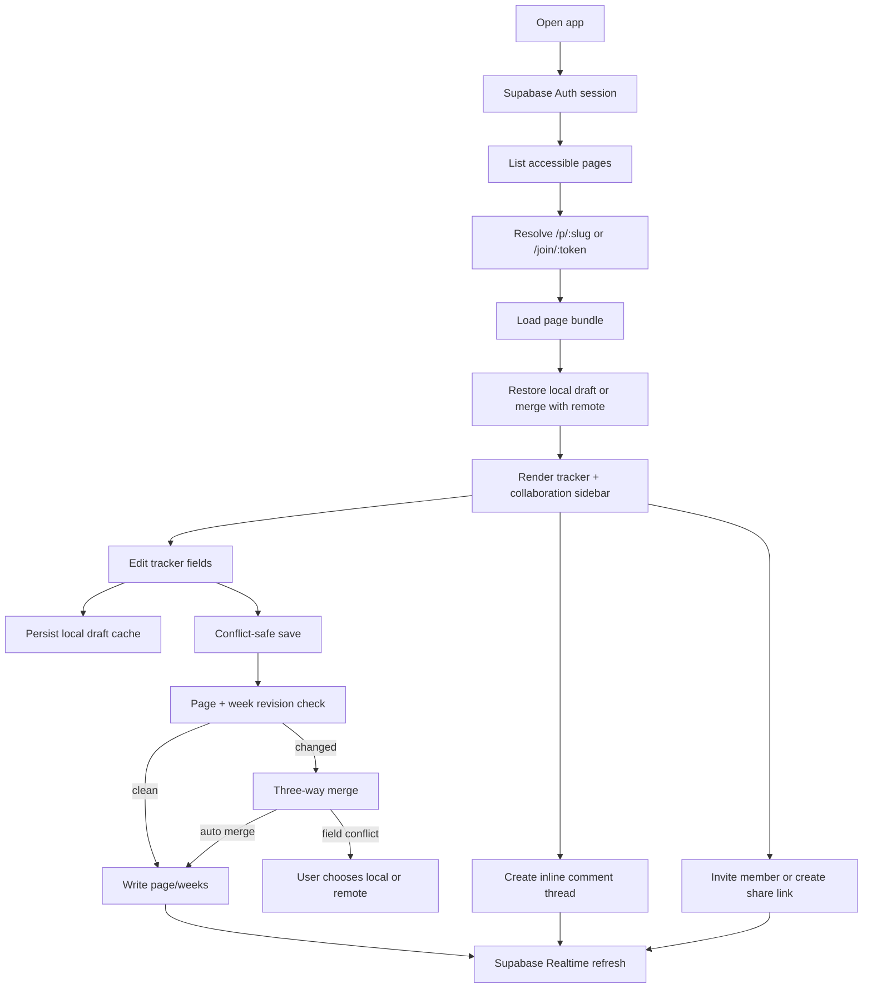

# Mission Tracker Collaboration Pipeline

## Before the refactor

The original app was a single-page script that wrote one user's tracker state into:

1. `localStorage`
2. local JSON files through `server.js`
3. optional Supabase rows keyed by `user_id`

That model was fine for private journaling, but structurally wrong for collaboration. It had no `page_id`, no shared permissions, no invite flow, no comment threads, and no conflict-safe save protocol.

## Current collaboration pipeline

The app is now organized around a `page` instead of a single user-owned tracker blob.

## Runtime layers

### `src/state`

- `schema.js` owns the durable tracker contract: `core`, daily `entries`, week grouping, score calculation, and compaction of empty days.
- `merge.js` owns three-way merge and conflict strategy application.

### `src/storage`

- `repository.js` is the only place that knows Supabase table names, RPCs, and conflict-aware persistence.
- `local-cache.js` stores page-scoped drafts, base snapshots, selected page slug, and pending share-link tokens.

### `src/ui`

- `render.js` is a pure rendering layer for tracker panels, collaboration panels, comments, members, and share links.
- `dom.js` provides a single map of DOM handles, so controller code does not scatter selectors everywhere.

### `src/controller.js`

The controller orchestrates:

1. auth state
2. route resolution
3. page loading
4. local-draft restoration
5. autosave and manual save
6. conflict handling
7. realtime refresh
8. comment / invite / share-link actions

## Data model

### Page model

- `mission_tracker_pages`
- `mission_tracker_page_members`
- `mission_tracker_page_invites`
- `mission_tracker_share_links`
- `mission_tracker_page_weeks`

This separates ownership from collaboration and keeps daily tracker data sharded by ISO week.

### Comments

- `mission_tracker_comment_threads`
- `mission_tracker_comments`

Threads are anchored to concrete fields such as:

- `core:mission`
- `entry:2026-04-30:reflection:lesson`
- `entry:2026-04-30:principle:mechanism`
- `entry:2026-04-30:action:rl_deep_work`

## Conflict-safe persistence

The save path is intentionally pessimistic about silent overwrites.

1. The controller keeps a `baseSnapshot` from the last synced remote state.
2. The user edits a separate `draft`.
3. Save checks page revision and week revisions.
4. If the remote changed, the controller loads the fresh bundle and runs a three-way merge:
   - `base`
   - `local draft`
   - `remote`
5. Non-conflicting edits merge automatically.
6. Same-field conflicts open a resolution panel where the user chooses local or remote.

## Security posture

- Public deployment is static-only. Writes go through Supabase RLS.
- `server.js` now defaults to `127.0.0.1` and is intended only for trusted local workflows.
- Share links are stored as token hashes and redeemed through RPC after login.
- Direct email invites are accepted via RPC that checks the authenticated user's email claim.

## Operational note

`public/` remains a generated directory. Source of truth now lives in:

- `app.js`
- `index.html`
- `styles.css`
- `src/**`

`npm run build` copies those sources into `public/` for static hosting.
