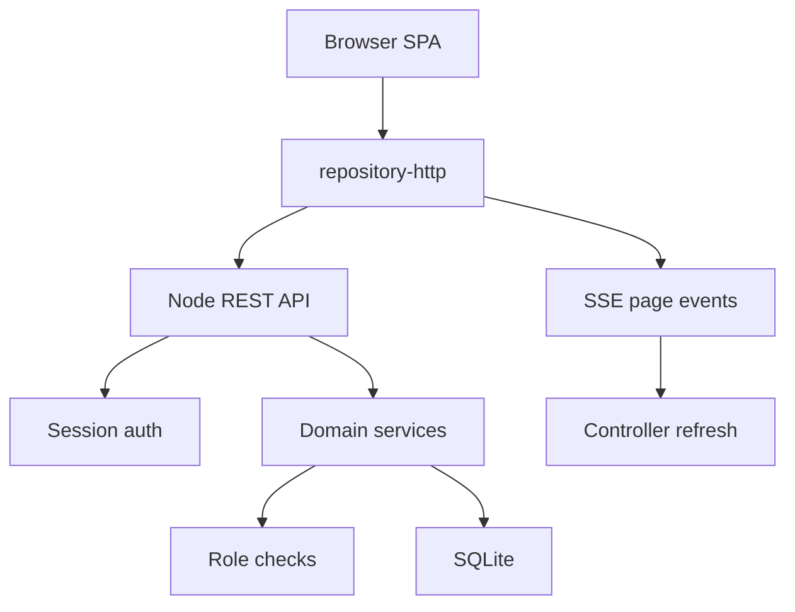
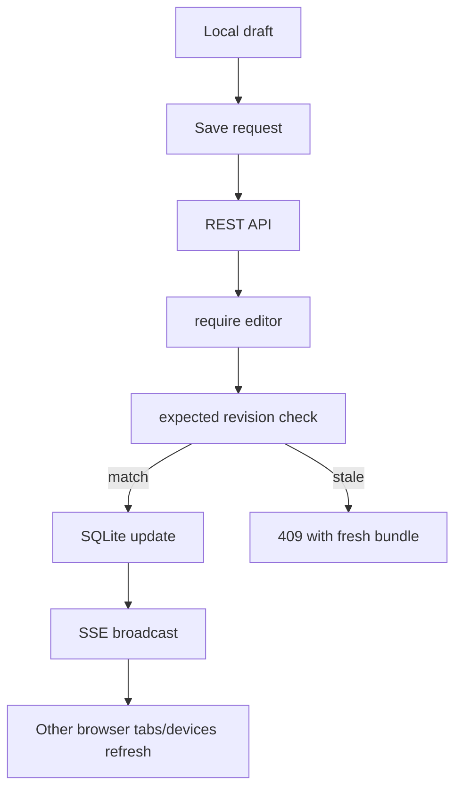

# Local Collaboration Pipeline

Mission Tracker now uses a local Node + SQLite architecture.

## Startup

1. `node server.js`
2. `server/db.js` opens `data/mission-tracker.sqlite`
3. schema is created if needed
4. first local admin is created if no users exist
5. static files and REST API are served from one process

## Frontend Flow

1. `src/main.js` creates `repository-http`
2. `src/controller.js` calls `GET /api/auth/session`
3. if signed in, pages are loaded from `GET /api/pages`
4. the selected page loads through `GET /api/pages/:pageId/bundle`
5. edits save through revision-checked REST calls
6. page events arrive through `GET /api/pages/:pageId/events`

## Backend Boundaries

- `server/api.js`: URL routing only
- `server/auth.js`: local users, password verification, session cookies
- `server/permissions.js`: centralized role checks
- `server/services/pages.js`: pages, weeks, members, invites, share links
- `server/services/comments.js`: comment threads and replies
- `server/realtime.js`: Server-Sent Events fanout

Business rules should stay in services, not in route parsing or UI code.

## Save Pipeline

## Sharing Pipeline

Direct invite:

1. owner creates invite for an email
2. invited user signs in
3. pending invite appears
4. accept creates/updates `page_members`

Share link:

1. owner creates a link
2. server stores only `token_hash`
3. raw token is shown once
4. logged-in user joins by submitting the raw token
5. server adds `page_members` row with the link role

## Comment Pipeline

1. user selects a field comment chip
2. thread is created through `POST /api/pages/:pageId/comment-threads`
3. replies go through `POST /api/comment-threads/:threadId/comments`
4. resolve/reopen goes through `PATCH /api/comment-threads/:threadId`
5. comments are included in the next page bundle refresh

## Legacy JSON

The old files are not the collaboration backend:

- `data/core.json`
- `data/weeks/*.json`

They are only read as a migration source when creating a first page.
